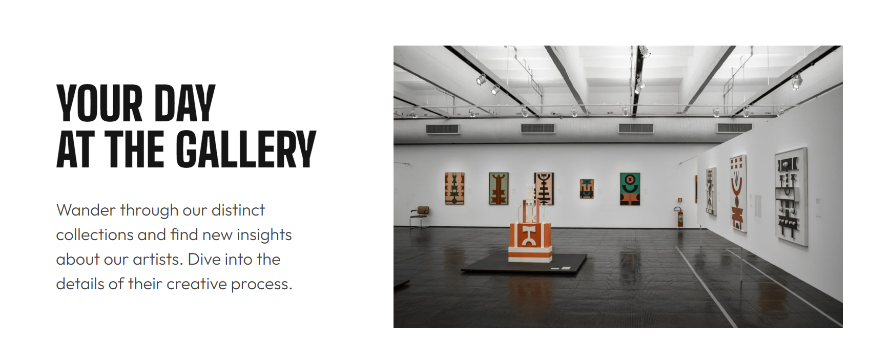
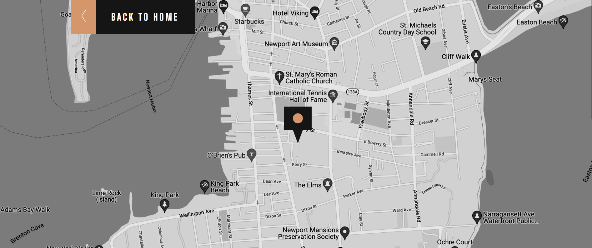

# Frontend Mentor - Art gallery website solution

## Table of contents

- [Overview](#overview)
  - [Screenshot](#screenshot)
  - [Links](#links)
- [My process](#my-process)
  - [Built with](#built-with)
  - [What I learned](#what-i-learned)
  - [Continued development](#continued-development)
  - [Useful resources](#useful-resources)
- [Acknowledgments](#acknowledgments)

## Overview

This is a solution to the [Art gallery website challenge on Frontend Mentor](https://www.frontendmentor.io/challenges/art-gallery-website-yVdrZlxyA).

### Screenshot

### Links

- Solution URL: [Solution URL here](https://github.com/NunuAbuashvili/Art-Gallery-Website.git)
- Live Site URL: [Live site URL here](https://nunuabuashvili.github.io/Art-Gallery-Website/)

## My process

### Built with

- Semantic HTML5 markup
- CSS custom properties
- Flexbox
- CSS Grid
- Mobile-first workflow

### What I learned

This was a challenging project in terms of aligning images and content of the page in a way, that would lead to the best outcome for viewers with different screen sizes. While working through this project I had to change the color of the end of the heading (Modern Art Gallery). At first, I tried using <mix-blend-mode: multiply>, but the outcome was not the best. Later I found out that linear-gradient CSS function would be the best solution for this problem.

Also this was the first project where I learnt about the HTML anchor tag as a mean of connecting two pages (in this case: the main page and the location page).

### Continued development

I am still not confident in using absolutely positioned objects, so I would like to learn more about that in future projects.

### Useful resources

- [CSS Color Filter Generator](https://angel-rs.github.io/css-color-filter-generator/) - This helped me change the color of SVG images.
- [CSS Linear Gradient Generator](https://cssgradient.io/) - Here I entered two colors and the tool generated a perfect color gradient with its CSS code for me.

## Acknowledgments

I would like to thank Bitcamp 101 (Georgia) for offering amazing lectures, and also, my mentor Paata Gharibashvili who has helped me overcome the difficulties by giving me a lot of valuable advice.
